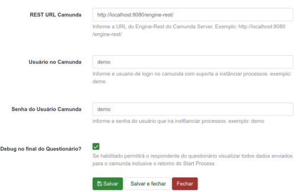

# Lime2Camunda
Limesurvey Surveys for Camunda BPM Plataform Integration

## Translate
[Portuguese] (https://github.com/projeto-cade-unb/Lime2Camunda/blob/main/README.pt-BR.md)

[English] (https://github.com/projeto-cade-unb/Lime2Camunda/REAMDE.md)

## Features
This plugin allows a process to be started in camunda after filling out a Limesurvey and all questions are sent as variables to Camunda.

## Install
The same is a Limesurvey plugin and follow all your recommendations.

* Stable versions:
 download releases in https://github.com/projeto-cade-unb/Lime2Camunda/releases
  copy the release in extract to the Limesurvey plugins folder and access the plugin manager to configure and enable.

* For developer version:
  to install just copy the project to the Limesurvey plugins folder and access the plugin manager to configure and enable.

## Configs plugin

urlrestcamunda = Enter Your Camunda Server EndPoint URL  Sample: http://localhost:8080/engine-rest/

usercamunda = Your user in Camunda Server. Sample: demo

passcamunda = Your password in Camunda Server. Sample: demo

debugresponse = Displays a debug screen at the end of the survey if TRUE.

## ScreenShots

### ScreenShot Config

### ScreenShot Debug

### New features in RoadMap 0.02
   - Add user and password in survey
   - Add send to camunda in question parameters.
   - remove question DEFINITIONKEY and add parameter in Survey

## Configs Surveys

 * Add One question in first position your survey with code DEFINITIONKEY and add your CAMUNDA DEFINITION KEY for Default value this Question.
 * Hidden this question.

# Credits
 * Marcio Junior Vieira - Dev - Projeto CADE UNB.
 * Vinícius Eloy - Mentor - Projeto CADE UNB.

# License
  [License GPL v3.0](https://github.com/projeto-cade-unb/LICENSE.GPLv3)
