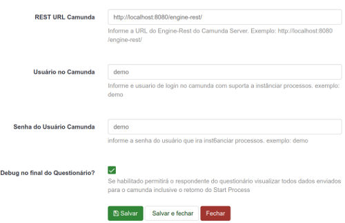
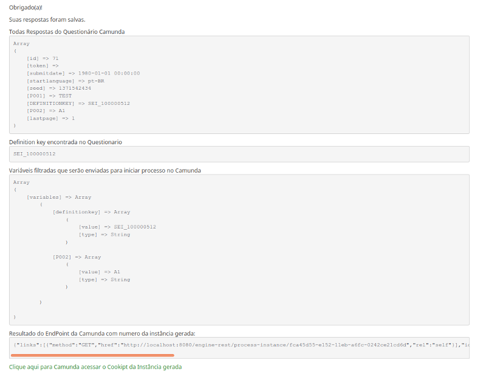

# Lime2Camunda
Integração de formulários Limesurvey com Camunda BPM Plataform.

## Características
Este plugin permite que um processo seja iniciado na camunda após o preenchimento de um Limesurvey e todas as perguntas são enviadas como variáveis para a Camunda.

## Instalação
O mesmo é um plugin Limesurvey e siga todas as suas recomendações.

* Versões estáveis:
 Baixe as releases em https://github.com/projeto-cade-unb/Lime2Camunda/releases copie a versão descompactada para a pasta de plugins do Limesurvey e acesse o gerenciador de plugins para configurar e habilitar.

* Versão do desenvolvedor:
Para instalar basta copiar o projeto para a pasta de plugins do Limesurvey e acessar o gerenciador de plugins para configurar e habilitar.

## Configuração do Plugin

urlrestcamunda = Digite o exemplo de URL do seu Camunda Server EndPoint: http://localhost:8080/engine-rest/

usercamunda = Seu usuário no Camunda Server. Exemplo: demo

passcamunda = Sua senha no Servidor Camunda. Exemplo demo

debugresponse = Exibe uma tela de depuração no final da pesquisa se TRUE.

## Screenshots

### Screenshot Config

### Screenshot Debug

### Novas funcionalidades - RoadMap 0.02
    - Adicionar usuário e senha na pesquisa.
    - Adicionar enviar para camunda nos parâmetros da questão.
    - Remova a pergunta DEFINITIONKEY e adicione o parâmetro na pesquisa.

## Configurações de formulário

* Adicione uma pergunta na primeira posição da sua pesquisa com o código DEFINITIONKEY e adicione sua CAMUNDA DEFINITION KEY para o valor padrão desta pergunta.

* Escondido esta pergunta.

# Créditos
 * Marcio Junior Vieira - Dev - Projeto CADE UNB.
 * Vinícius Eloy - Mentor - Projeto CADE UNB.

# Licença
  [License GPL v3.0](https://github.com/projeto-cade-unb/LICENSE.GPLv3)
